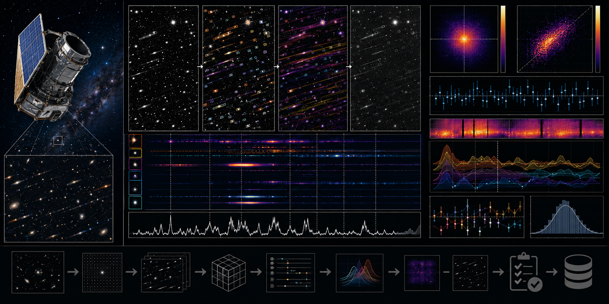

# Euclid NISP Spectral-Contamination Reliability Audit



> **Curation:** `BUILD_FIRST` · Priority 9.4/10 · real public Euclid Q1 NISP products

## Scientific question

How do released contamination indicators relate to continuum S/N, emission-line recovery and redshift reliability in selected NISP spectra?

## What this repository contributes

An external audit; not a decontamination, extraction or redshift pipeline.

## Key result

On real Euclid Q1 tile 102160061 (RGS grism, n=6000 objects), the released `spe_error_flag` contamination indicator is constant across the entire real catalogue (n_clean=6000, n_flagged=0) — the planned clean/flagged split is degenerate for this tile. This is reported as a genuine finding, not a code failure: the group-comparison, threshold-sensitivity and negative-control metrics are `NaN`/omitted in `results/summary.json`, with the exact reason recorded in `results/warnings.json` ("contamination split is degenerate (n_clean=6000, n_flagged=0)"). The synthetic injection-recovery gate passed independently — a strong injected Gaussian line is correctly recovered and detected above the S/N threshold, and the permuted-label negative control correctly rejects the null (p<0.05) for a real injected effect, confirming the pipeline itself works; it is the real catalogue's flag that turned out to carry no discriminating signal for this tile.

## Reproducing this result

```bash
python -m venv .venv
# Windows PowerShell
.venv\Scripts\Activate.ps1
python -m pip install -e ".[dev]"
pytest -q
python scripts/run_analysis.py --demo
python scripts/make_figures.py --demo
```

The demo path above uses clearly-labelled synthetic data for a fast smoke test. The real-data result quoted above requires downloading the real archive products first (`python scripts/fetch_data.py --i-have-authorization`), then `python scripts/run_analysis.py` and `python scripts/make_figures.py` without `--demo`.

For the web dashboard:

```bash
cd web-react
npm install
npm run dev
```

## Research documentation

- `CURATION_STATUS.md`
- `docs/RESEARCH_BLUEPRINT.md`
- `docs/DATASET_PLAN.md`
- `docs/LITERATURE_SEEDS.md`
- `docs/VALIDATION_CONTRACT.md`
- `docs/FIGURE_AND_UI_SPEC.md`

## Reproducibility and FAIR practice

All real inputs require product IDs, retrieval times, checksums, source terms and deterministic selection manifests. Derived results record the software commit and configuration hash.

## Limitations

- An external audit of a released contamination flag; not a decontamination, extraction or redshift pipeline.
- On the one real tile analysed (102160061), the contamination flag used is degenerate (constant across all 6000 objects) — the group-comparison analysis this project was designed to run could not be exercised on real data as a result, and this is reported transparently rather than hidden or substituted with a different flag after the fact.
- Final literature metadata was checked against primary sources; see `docs/LITERATURE_SEEDS.md` for any items still marked `TODO_VERIFY`.

## Author

Biswajit Jana

## Licence

BSD-3-Clause for original code. Mission/archive products retain their original terms.
